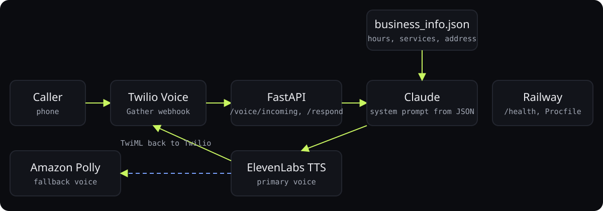

<div align="center">

# SG CPA voice receptionist

**A Claude-powered phone receptionist that answers hours, services, and location, and never makes things up.**

<p>
<a href="https://ibiraheel.com/p/sg-receptionist"></a>
</p>

<p>


</p>

</div>

<br>

> **After-hours calls answered, zero hallucinated answers**  
> for SG CPA, a certified public accounting firm in Plano, Texas

## What it did

Twilio hands each utterance to FastAPI, Claude answers from a strict business-facts prompt, ElevenLabs speaks it, and Polly takes over if ElevenLabs fails.

<sub>Outcome: illustrative.</sub>

## How it works

<p align="center"></p>

1. Twilio Gather webhooks instead of media streams: simpler, cheaper, good enough for Q&A calls.
2. System prompt is templated from business_info.json so the same code serves any firm.
3. Claude called with max 256 tokens and temperature 0.3 to keep answers short and literal.
4. ElevenLabs TTS with automatic Polly fallback so a vendor outage never drops a call.
5. Health endpoint and Railway config for one-command deploys.

## Run it locally

```bash
python3 -m venv .venv && source .venv/bin/activate
pip install -r requirements.txt
cp .env.example .env                    # Anthropic, Twilio, ElevenLabs
uvicorn app.main:app --reload --port 8000
```

Point your Twilio number's voice webhook at `POST /voice/incoming`. Deploys as-is to
Railway (`Procfile`, `railway.toml`).

## Repository layout

```
├── app/
│   ├── __init__.py
│   ├── claude_client.py
│   ├── config.py
│   ├── elevenlabs_client.py
│   ├── main.py
│   └── voice_handler.py
├── data/
│   ├── business_info.json
│   └── system_prompt.txt
├── docs/
│   └── superpowers/
├── tests/
│   ├── __init__.py
│   ├── test_claude_client.py
│   ├── test_config.py
│   ├── test_elevenlabs_client.py
│   ├── test_main.py
│   └── test_voice_handler.py
├── Procfile
├── railway.toml
└── requirements.txt
```

---

<div align="center">

<sub>Built by <a href="https://github.com/ibi-raheel">Muhammad Ibrahim Raheel</a> · more work at <a href="https://ibiraheel.com">ibiraheel.com</a></sub>

</div>
